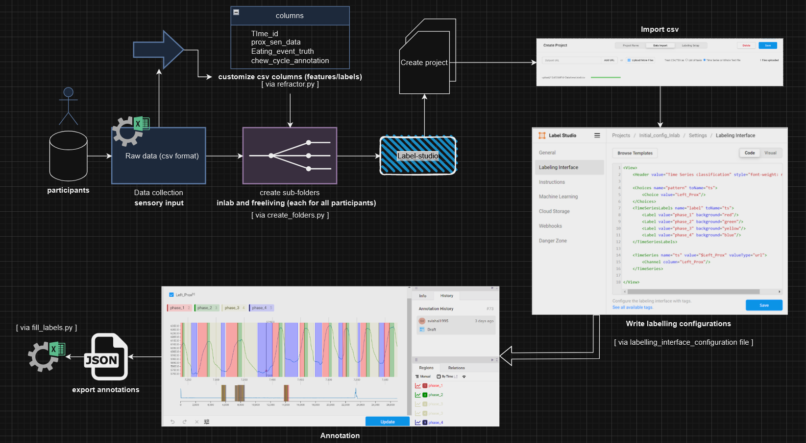
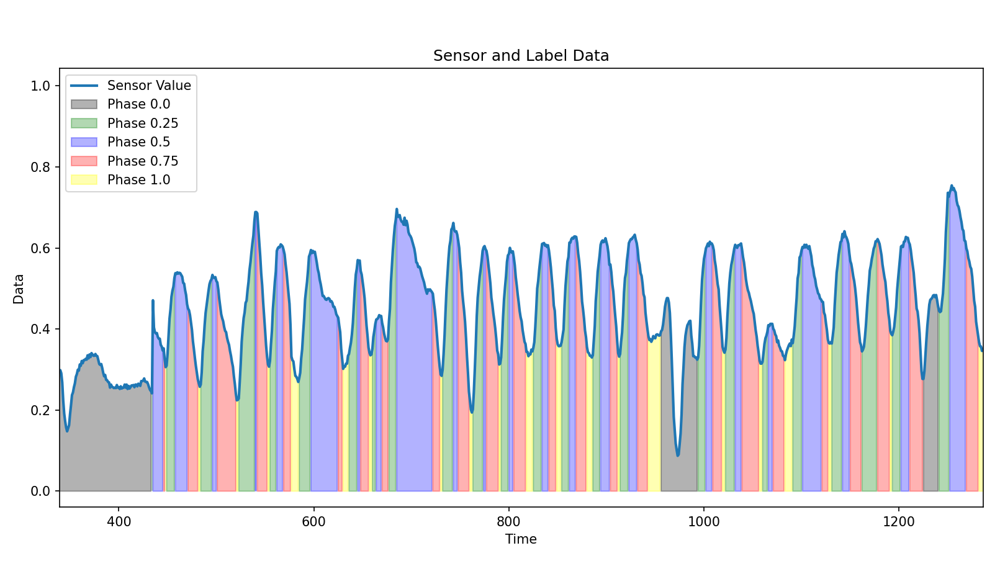

----------------------------
What is this section about ?
---------------------------

Consider a Black-Box where you are getting values from a proximity sensor, as a time-series data. You want to predict and do inference with those values for certain classes using best approaches, such just it is optimized to full possibility and doesn't create any overhead during real-time communications.

You have the sensor and a microcontroller board (in this repository mostly everything is related to STM32-ULP).


---------------------------
Data Collection and Annotation
---------------------------

One possible approach for data annotation after raw data collection from sensors:

- __Label Studio__
<a href="https://labelstud.io/" target="_blank">Visit Label Studio</a>



An example of how configuration can be done in label-studio to represent different classes:
```xml
<View>

<Header value="Time Series classification" style="font-weight: normal"/>
        
<Choices name="pattern" toName="ts">
    <Choice value="Left_Prox"/>
</Choices>

<TimeSeriesLabels name="label" toName="ts">
    <Label value="phase_1" background="red"/>
    <Label value="phase_2" background="green"/>
    <Label value="phase_3" background="yellow"/>
    <Label value="phase_4" background="blue"/>
</TimeSeriesLabels>

<TimeSeries name="ts" value="$Left_Prox" valueType="url">
    <Channel column="Left_Prox"/>
</TimeSeries>
   
</View>
```
---------------------------
__How the data looks like after annotation of each phase of a chewing sequence:__




---------------------------

---------------------------
# Feature Engineering 
---------------------------

__Transforming raw data into features__

__The performance of ML models heavily depends on the relevance of the features used to train them.__

5 processes in feature engineering:
-->Feature Creation
-->Feature Transformation
-->Feature Extraction
-->Feature Selection
-->Feature Scaling