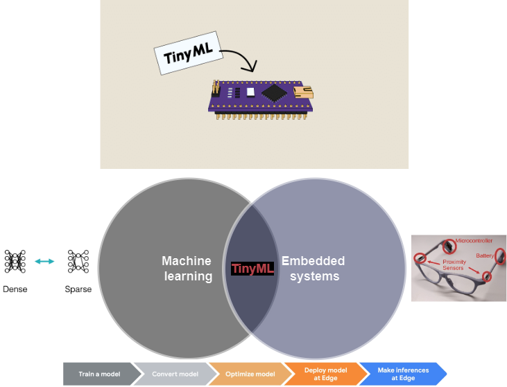

# Tiny-ML@IES

For full project details visit [TinyML4PAD](https://github.com/WiresharkIO/TinyML4PAD.git).

----------------------------
# What is this section about ?
---------------------------

Consider a Black-Box where you are getting values from a proximity sensor, as a time-series data. You want to predict and do inference with those values for certain classes using best approaches, such just it is optimized to full possibility and doesn't create any overhead during real-time communications.

You have the sensor and a microcontroller board (in this repository mostly everything is related to STM32-ULP).

	

## Contents
<!--
[Go to "What is this section about?" in About](about.md#what-is-this-section-about)
-->
[Go to "Data Collection and Annotation" in About](about.md##Data-Collection-and-Annotation)

## Project layout

    mkdocs.yml    # The configuration file.
    docs/
        index.md  # The documentation homepage.
        about.md # Other markdown pages, images and other files.
